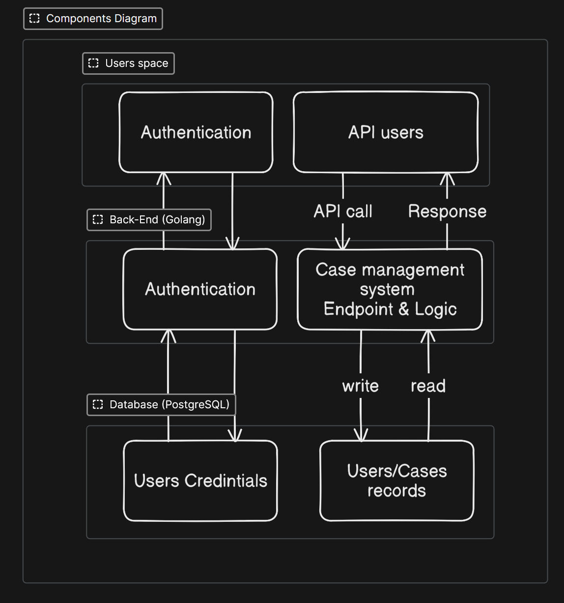

## System overview and Scope:
Case management system is a system that let users/teams create, assign, move, resolve and delete cases. Cases can be put into specific workflows that governs how cases should be handled. The system should be generic enough to support different use cases like support tickets, fraud review, customer complaint, etc. Workflows consist of stages which represent the steps that the case move through to be resolved. Lastly, cases' history should be documented and logged

This document covers the necessary components to build the **MVP** (Minimum Viable Product) of the Case management system. focusing on high level architecture, object modeling, and data sharing/governance between different **API** (Application Programming Interface) endpoints


## 1. Architecture
### 1.1 Architectural style and rationale:
The system will use a **Micro-Service Architectural Style** for the MVP to insure that the system is maintainable, and modular. Hence making it scalable and easier to integrate new features. 


### 1.2 Key Strategies
Given the current experience of the team and the requirements for this project, we will use the follow technologies:

- Utilize **Golang** for a robust back-end and to conform with Stitch's developers' expertise.
- Use **PostgreSQL** for a scalable database management. The simplicity and structure of our data aligns well with this type of databases.


### 1.3 Overview of Layers/Modules:
- **Users layer**: The layer which users use and interact with API.
- **Back-End Module:** Manages server-side logic, API requests, and database interactions.
- **Database Module:** Stores and retrieves all application data.


### 1.4 Component Diagrams
[


### 1.5 Architecture constraints for V1:
In version 1 of the system the focus is on building a useful albeit limited system, while also being welcoming to new features that might be added in the future. This is an MVP hence we do not want to spend too much resources building a complex system. Therefore the following constraints are applied:

- The system will only support linear workflows, while still being able to skip stages that might not be applicable to the current case. This choice is made to avoid branching complexity.
- There will not be a notification system that notify users on events like case assignment, or stage transition. This feature could be implemented in V1, but we do not want to get into the rabbit hole of scope creeping.
- Lastly, authentication will be omitted due the fact that authentication for this System will rely on stitch's authentication module.


## 2. Object Modeling 
### 2.1 Objects Definition: 
- **organization:** Stores information about the corporate clients using Stitch.
- **users**: Stores details of the individuals working within an organization, featuring explicit role assignments.
- **workflows**: Defines the customized case pipelines unique to an organization's operations.
- **stages**: Represents the specific, ordered tracking steps belonging to a given workflow that dictate a case's lifecycle.
- **teams**: Stores the different functional groups within an organization.
- **team_members**: A many-to-many junction table that links users to one or more teams, allowing users to belong to multiple functional groups.
- **cases**: The central operational table tracking the core work items, their active workflow, current stage, and assignee, utilizing a dynamic metadata block for custom configuration fields.
- **case_history**: An immutable logging ledger that records every historical state change, transition, and update performed on a case for auditing purposes.
### 2.2 Entity Relational Diagram
[](https://app.eraser.io/workspace/FqPVitrKNOsQbBW8PHxh?diagram=wZBb5fn-1SH0htoByUbZ)


## 3. API Design
### 3.1 API functions:
Desired functionalities of the API that would satisfy and implement the system's requirements:

- Create case
- Modify case
- Assign user/team to case
- Delete case
- Create team
- Modify team
- Assign user to team
- Delete team
- Create workflow
- Modify workflow
- Delete workflow
- Create stage
- Modify stage
- Delete stage
- Search history


### 3.2 API Implementation
### 3.2.1 Global Patterns
- **Standard Error Payload:** For all `4xx` and `5xx` responses, the system returns a structured object:
```
{
  "error": {
    "code": "INVALID_PARAMETER",
    "message": "The provided assigned_user_id does not belong to the organization.",
    "details": [
      { "field": "assigned_user_id", "issue": "User organization mismatch" }
    ]
  }
}
```
### 3.2.2 Cases Endpoints
**Create Case**

Initializes a new case tracking instance. The system automatically resolves and assigns the `current_stage_id` to the first stage in the workflow sequence (`stage_order = 1`).

- **Method & Path:** `POST /v1/cases` 
- **Request Payload:**
JSON

```
{
  "title": "Onboarding Request",
  "description": "New hire setup",
  "workflow_id": "8b5f3a1e-84fc-4e6e-a342-9952bf89c8a1",
  "organization_id": "4d1a3c5b-1111-2222-3333-444455556666",
  "metadata": { "priority": "high" }
}
```
- **Success Response (**`**201 Created**` **):**
JSON

```
{
  "id": "f81d4fae-7dec-11d0-a765-00a0c91e6bf6",
  "title": "Onboarding Request",
  "description": "New hire setup",
  "workflow_id": "8b5f3a1e-84fc-4e6e-a342-9952bf89c8a1",
  "current_stage_id": "11a2b3c4-90ab-cdef-1234-567890abcdef", 
  "organization_id": "4d1a3c5b-1111-2222-3333-444455556666",
  "metadata": { "priority": "high" },
  "assigned_to_team_id": null,
  "assigned_to_user_id": null,
  "created_at": "2026-07-02T20:15:00Z",
  "updated_at": "2026-07-02T20:15:00Z"
}
```
- **Status Codes:**
    - `201 Created` : Case successfully created.
    - `400 Bad Request` : Missing mandatory body parameters.
    - `422 Unprocessable Entity` : The specified `workflow_id`  or `organization_id`  does not exist.

#### Modify Case
Updates core case metadata or progresses a case across different stages.

- **Method & Path:** `PATCH /v1/cases/{case_id}` 
- **Request Payload:**
JSON

```
{
  "title": "Updated Onboarding Title",
  "current_stage_id": "22b3c4d5-90ab-cdef-1234-567890abcdef",
  "metadata": { "priority": "critical" }
}
```
- **Success Response (**`**200 OK**` **):**
JSON

```
{
  "id": "f81d4fae-7dec-11d0-a765-00a0c91e6bf6",
  "title": "Updated Onboarding Title",
  "description": "New hire setup",
  "workflow_id": "8b5f3a1e-84fc-4e6e-a342-9952bf89c8a1",
  "current_stage_id": "22b3c4d5-90ab-cdef-1234-567890abcdef",
  "organization_id": "4d1a3c5b-1111-2222-3333-444455556666",
  "metadata": { "priority": "critical" },
  "assigned_to_team_id": null,
  "assigned_to_user_id": null,
  "created_at": "2026-07-02T20:15:00Z",
  "updated_at": "2026-07-02T20:18:00Z"
}
```
- **Status Codes:**
    - `200 OK` : Resource successfully updated.
    - `404 Not Found` : Case identifier not found.
    - `422 Unprocessable Entity` : The target `current_stage_id`  does not belong to the associated workflow.

#### Assign User/Team to Case
Dedicated transactional interface to manage resource allocations for a case.

- **Method & Path:** `PATCH /v1/cases/{case_id}/assignment` 
- **Request Payload:**
JSON

```
{
  "assigned_to_team_id": "99eeaa11-2222-3333-4444-555566667777",
  "assigned_to_user_id": "33ccbb44-5555-6666-7777-888899990000"
}
```
- **Success Response (**`**200 OK**` **):** Full case JSON schema detailing the newly updated assignment fields.
- **Status Codes:**
    - `200 OK` : Ownership assigned successfully.
    - `422 Unprocessable Entity` : The designated team or user belongs to a completely different organization entity.

#### Delete Case
Removes a case tracking instance.

- **Method & Path:** `DELETE /v1/cases/{case_id}` 
- **Success Response (**`**204 No Content**` **):** No body returned.
- **Status Codes:**
    - `204 No Content` : Deletion successful.
    - `404 Not Found` : Case not found.

#### Search Case History
Retrieves an audit trail ledger capturing lifecycle movements, stage progression, and structural assignments over time.

- **Method & Path:** `GET /v1/cases/{case_id}/history` 
- **Query Parameters:**
    - `action_type`  (string, optional)
    - `user_id`  (UUID, optional)
    - `case_id`  (UUID, optional)

- **Success Response (**`**200 OK**` **):**
JSON

```
{
  "data": [
    {
      "id": "e2a1b0c9-3333-4444-5555-666677778888",
      "case_id": "f81d4fae-7dec-11d0-a765-00a0c91e6bf6",
      "action_type": "STAGE_CHANGE",
      "old_value": "11a2b3c4-90ab-cdef-1234-567890abcdef",
      "new_value": "22b3c4d5-90ab-cdef-1234-567890abcdef",
      "user_id": "33ccbb44-5555-6666-7777-888899990000",
      "created_at": "2026-07-02T20:18:00Z"
    }
  ]
}
```
- **Status Codes:**
    - `200 OK` : Query successful.
    - `404 Not Found` : Target case ID does not exist.

### 3.2.3 Teams Endpoints
#### Create Team
- **Method & Path:** `POST /v1/teams` 
- **Request Payload:**
JSON

```
{
  "name": "Customer Support Tier 1",
  "organization_id": "4d1a3c5b-1111-2222-3333-444455556666"
}
```
- **Success Response (**`**201 Created**` **):**
JSON

```
{
  "id": "99eeaa11-2222-3333-4444-555566667777",
  "name": "Customer Support Tier 1",
  "organization_id": "4d1a3c5b-1111-2222-3333-444455556666",
  "created_at": "2026-07-02T20:15:00Z"
}
```
- **Status Codes:** `201 Created` , `400 Bad Request` .
#### Modify Team
- **Method & Path:** `PATCH /v1/teams/{team_id}` 
- **Request Payload:**
JSON

```
{
  "name": "Global Support Tier 1"
}
```
- **Success Response (**`**200 OK**` **):** Updated team object representation.
- **Status Codes:** `200 OK` , `404 Not Found` .
#### Assign User to Team
Maps structural membership associations to the underlying `team_members` junction schema.

- **Method & Path:** `POST /v1/teams/{team_id}/members` 
- **Request Payload:**
JSON

```
{
  "user_id": "33ccbb44-5555-6666-7777-888899990000"
}
```
- **Success Response (**`**201 Created**` **):**
JSON

```
{
  "team_id": "99eeaa11-2222-3333-4444-555566667777",
  "user_id": "33ccbb44-5555-6666-7777-888899990000",
  "joined_at": "2026-07-02T20:15:00Z"
}
```
- **Status Codes:**
    - `201 Created` : User mapped to team.
    - `409 Conflict` : Membership unique constraint violation (user already a member).
    - `422 Unprocessable Entity` : User domain/organization context mismatch.

#### Delete Team
- **Method & Path:** `DELETE /v1/teams/{team_id}` 
- **Success Response (**`**204 No Content**` **):** Void body.
- **Status Codes:**
    - `204 No Content` : Team successfully unmapped and removed.
    - `409 Conflict` : Active operational entities (`cases` ) are currently dependent on this team reference.

### 3.2.4 Workflows Endpoints
#### Create Workflow
- **Method & Path:** `POST /v1/workflows` 
- **Request Payload:**
JSON

```
{
  "name": "Standard Bug Triaging",
  "organization_id": "4d1a3c5b-1111-2222-3333-444455556666"
}
```
- **Success Response (**`**201 Created**` **):**
JSON

```
{
  "id": "8b5f3a1e-84fc-4e6e-a342-9952bf89c8a1",
  "name": "Standard Bug Triaging",
  "organization_id": "4d1a3c5b-1111-2222-3333-444455556666",
  "created_at": "2026-07-02T20:15:00Z"
}
```
- **Status Codes:** `201 Created` , `400 Bad Request` .
#### Modify Workflow
- **Method & Path:** `PATCH /v1/workflows/{workflow_id}` 
- **Request Payload:**
JSON

```
{
  "name": "Enterprise Bug Triaging"
}
```
- **Success Response (**`**200 OK**` **):** Updated workflow layout.
- **Status Codes:** `200 OK` , `404 Not Found` .
#### Delete Workflow
- **Method & Path:** `DELETE /v1/workflows/{workflow_id}` 
- **Success Response (**`**204 No Content**` **):** Void body.
- **Status Codes:**
    - `204 No Content` : Successful execution.
    - `409 Conflict` : Cases exist utilizing this active state machine sequence.

### 3.2.5 Stages Endpoints
#### Create Stage
- **Method & Path:** `POST /v1/workflows/{workflow_id}/stages` 
- **Request Payload:**
JSON

```
{
  "name": "Triage Pending",
  "status": "ACTIVE",
  "stage_order": 1
}
```
- **Success Response (**`**201 Created**` **):**
JSON

```
{
  "id": "11a2b3c4-90ab-cdef-1234-567890abcdef",
  "workflow_id": "8b5f3a1e-84fc-4e6e-a342-9952bf89c8a1",
  "name": "Triage Pending",
  "status": "ACTIVE",
  "stage_order": 1
}
```
- **Status Codes:** `201 Created` , `404 Not Found`  (Workflow missing).
#### Modify Stage
- **Method & Path:** `PATCH /v1/workflows/{workflow_id}/stages/{stage_id}` 
- **Request Payload:**
JSON

```
{
  "name": "In Investigation",
  "stage_order": 2
}
```
- **Success Response (**`**200 OK**` **):** Returns updated stage properties.
- **Status Codes:** `200 OK` , `404 Not Found` .
#### Delete Stage
- **Method & Path:** `DELETE /v1/workflows/{workflow_id}/stages/{stage_id}` 
- **Success Response (**`**204 No Content**` **):** Void body.
- **Status Codes:**
    - `204 No Content` : Operation successful.
    - `409 Conflict` : Active `cases.current_stage_id`  dependencies exist on this entity.


